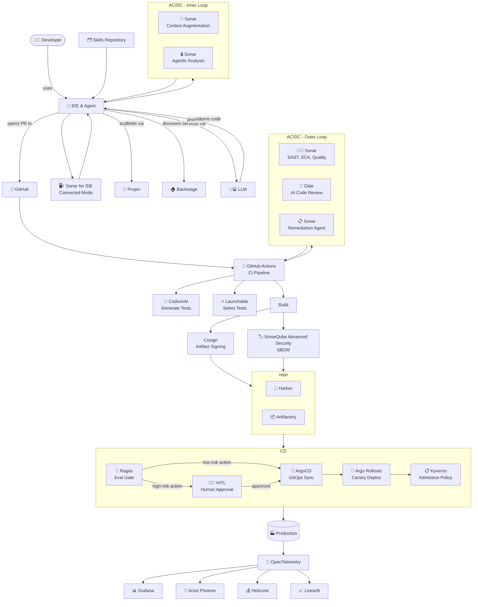
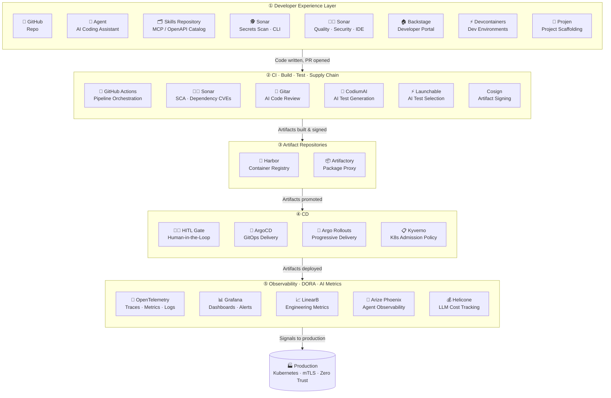

# Sample Internal Developer Platform

## Developer Workflow
This shows a possible workflow for developers in the new world of agent-centric development.

## Layered Architecture
This shows the layers in the architecture of the new IDP.

#### TODO:
* Remove tools mentioned here that are not mentioned above
* Move Sonar and other tools to the appropriate level
* Simplify the number of levels

