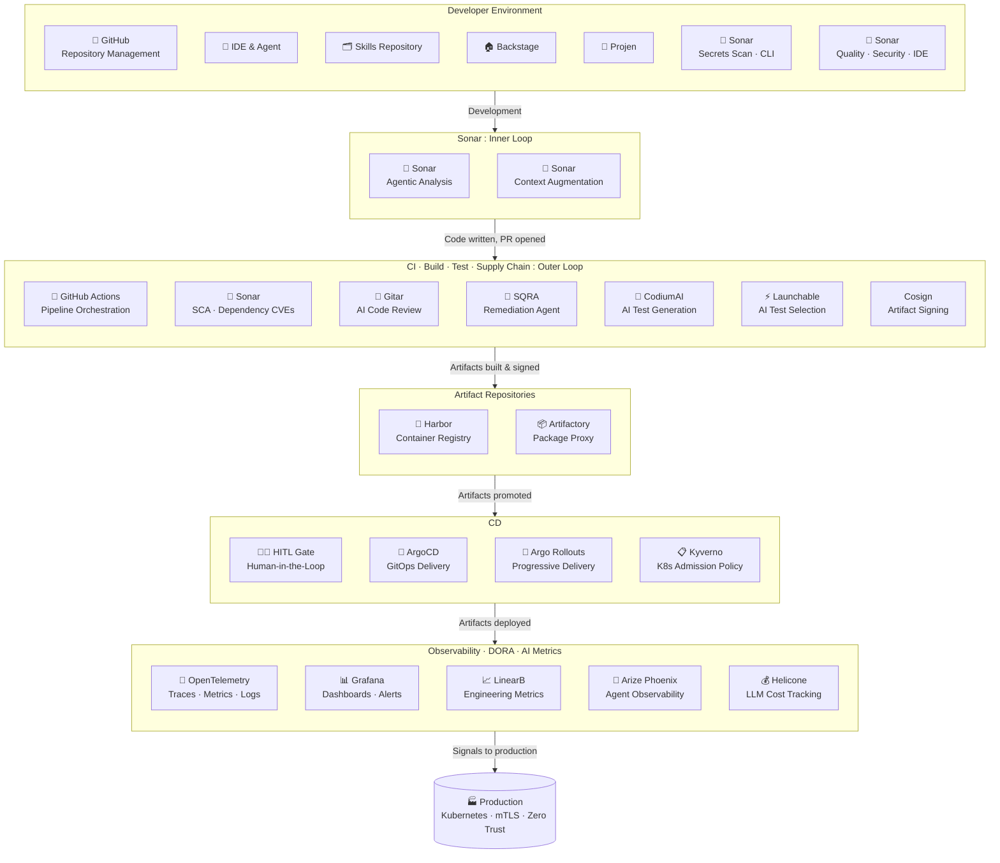

# Sample Internal Developer Platform

## Layered Architecture
This shows the layers in the architecture of the new IDP.

## Developer Workflow
This shows a possible workflow for developers in the new world of agent-centric development.

